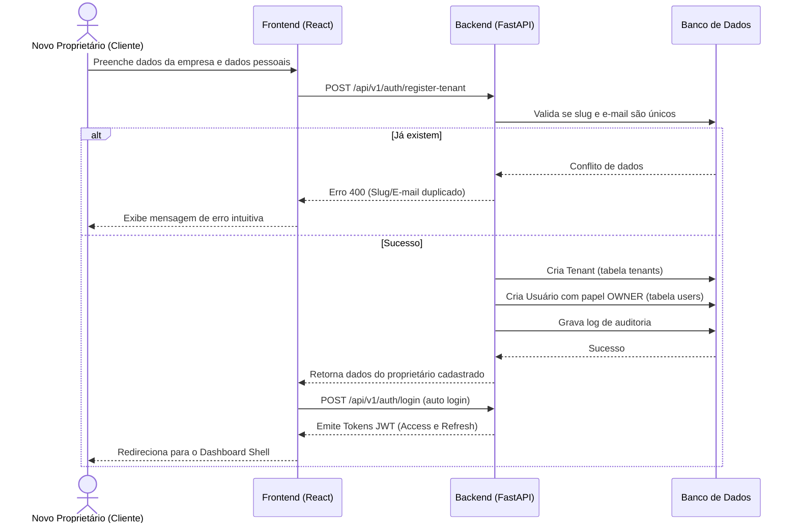
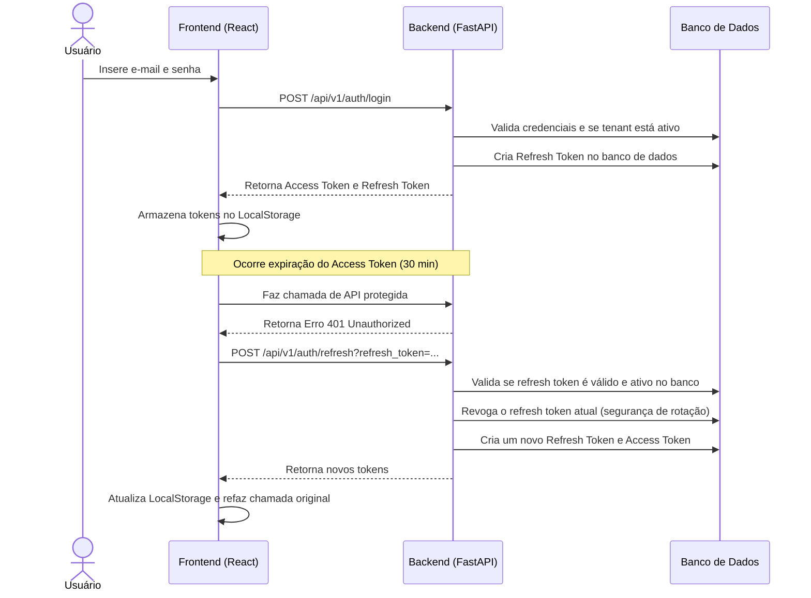

# Fluxos de Negócio - Módulo 0

Esta documentação descreve os principais fluxos operacionais de negócio da base da plataforma SaaS.

---

## 1. Fluxo de Registro de Nova Empresa (Tenant Onboarding)

Este fluxo representa a porta de entrada para novos clientes adquirirem o SaaS.

---

## 2. Fluxo de Login Seguro e Rotação de Token

Este fluxo assegura que as sessões sejam mantidas ativas sem que o usuário precise digitar a senha frequentemente, mantendo a segurança com rotação de refresh token (Token Rotation).

---

## 3. Fluxo de Gestão de Usuários (RBAC)

Fluxo operacional restrito para adição de novos funcionários no time.

1. **Acesso**: O Proprietário (`OWNER`) ou Gerente (`MANAGER`) entra na tela "Colaboradores".
2. **Formulário**: Preenche o nome, e-mail, senha inicial e seleciona o perfil (`OPERATOR`, `SUPERVISOR`, `MANAGER`).
3. **Restrição**:
   - Se o usuário ativo for um `MANAGER`, a seleção de perfil bloqueia a escolha de `OWNER` e `SUPER_ADMIN`.
4. **Gravação**: O Backend cria o usuário associado ao mesmo `tenant_id` do criador, encripta a senha com bcrypt e insere no banco.
5. **Auditoria**: É registrado um log de auditoria relacionando quem criou quem, o IP e o timestamp.
